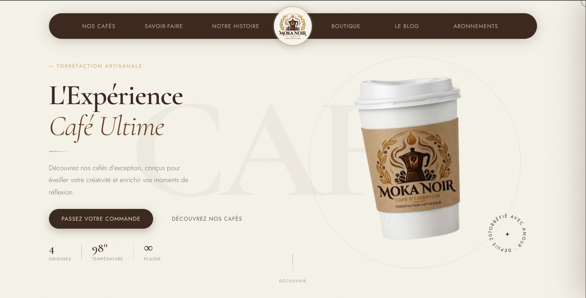

# Moka Noir — Artisanal Coffee Roastery

A **premium coffee roastery website** built with HTML, CSS and JavaScript, featuring GSAP animations, scroll-triggered reveals, an interactive shopping cart and a fully responsive layout.

---

## Features

- Cinematic preloader with letter-by-letter logo reveal and curtain transition
- Custom cursor with dot and trailing ring effect
- GSAP timeline hero entrance with staggered text and badge animations
- ScrollTrigger reveals across every section — about, menu, process, history timeline, origins, shop, gifts, testimonials and contact
- Animated brand history timeline with alternating left/right layout
- Interactive mini cart with quantity controls, live total and slide-in panel
- Order modal with Formspree integration for order submission
- Table reservation form with validation and Formspree integration
- Newsletter subscription form with Formspree integration
- 3D tilt hover effect on menu cards
- Infinite scrolling marquee banner
- Fully responsive — tablet and mobile breakpoints down to small devices

---

## Technologies Used

- **HTML5** – Semantic structure for clean, accessible markup
- **CSS3** – Custom properties, CSS Grid, Flexbox and responsive breakpoints
- **JavaScript (Vanilla)** – Cart logic, form handling, custom cursor and modal interactions
- **GSAP 3.12 + ScrollTrigger** – Timeline sequencing and scroll-based animations
- **Formspree** – Form submission handling for orders, reservations and the newsletter
- **Google Fonts** – Cormorant Garamond (serif) + Jost (sans-serif)

---

## Preview

